# LLM-Based Curriculum Recommendation Tool: Critical Path Analysis

**Project Leads:**  
- Kevin @kevinmastascusa 
- Joseph @Aethyrex 

**Date:** July 20, 2025  
**Status:** Active Development

---

## 📋 Executive Summary

This document outlines the critical path for the LLM-Based Curriculum Recommendation Tool for Sustainability and Climate Resilience. The critical path identifies the sequence of essential tasks that must be completed on time to ensure project success, including all dependencies from corpus curation through final deployment.

---

## 🎯 Critical Path Overview

---

## 🔄 Dependency Flowchart

**Legend:**
- 🟢 Green: Completed
- 🟡 Yellow: In Progress
- 🟠 Orange: Upcoming

---

## 📊 Current Status Assessment

### ✅ **Completed Components (85% Complete)**

#### 1. **Data Preparation Pipeline** 
- **Status:** ✅ COMPLETED
- **Progress:** 273 PDF documents processed, 4,859 chunks generated
- **Key Files:** 
  - `scaffold_core/scripts/chunk/ChunkTest.py`
  - `outputs/chunked_text_extracts.json`
- **Validation:** Unicode analysis completed, combined words issue resolved

#### 2. **Embedding Generation & Vector Database**
- **Status:** ✅ COMPLETED  
- **Progress:** FAISS index with 4,859 embeddings using sentence-transformers
- **Key Files:**
  - `scaffold_core/vector/main.py`
  - `vector_outputs/embeddings.npy`
  - `vector_outputs/faiss_index.bin`
- **Validation:** Similarity search operational, L2 normalized vectors confirmed

#### 3. **LLM Integration**
- **Status:** ✅ COMPLETED
- **Progress:** Mistral-7B-Instruct-v0.2 successfully integrated
- **Key Files:**
  - `scaffold_core/llm.py`
  - Model configuration in `scaffold_core/config.py`
- **Validation:** 100% test success rate, comprehensive testing suite implemented

#### 4. **Retrieval System Integration**
- **Status:** ✅ COMPLETED
- **Progress:** RAG pipeline operational with query system
- **Key Files:**
  - `scaffold_core/vector/enhanced_query.py`
  - `scaffold_core/vector/query.py`
- **Validation:** End-to-end testing completed successfully

### 🔄 **In Progress Components (15% Remaining)**

#### 5. **Citation Tracking Integration**
- **Status:** 🔄 IN PROGRESS (80% Complete)
- **Progress:** Citation handler implemented, needs final integration
- **Key Files:**
  - `scaffold_core/citation_handler.py`
  - `test_citation_ui.py`
- **Next Steps:** Complete citation display in UI responses

#### 6. **User Interface Development**
- **Status:** 🔄 IN PROGRESS (75% Complete)
- **Progress:** Flask server operational on localhost:5000
- **Key Files:**
  - `frontend/app.py`
  - `frontend/templates/`
- **Next Steps:** Finalize citation integration and result visualization

### 📋 **Upcoming Components**

#### 7. **Validation & Quality Assurance**
- **Status:** 📋 PLANNED
- **Dependencies:** Citation integration, UI completion
- **Estimated Duration:** 7 days
- **Focus Areas:** End-to-end testing, performance validation, citation accuracy

#### 8. **Stakeholder Feedback Integration**
- **Status:** 📋 PLANNED  
- **Dependencies:** Validation completion
- **Estimated Duration:** 7 days
- **Focus Areas:** User experience testing, content accuracy review

#### 9. **Final Testing & Documentation**
- **Status:** 📋 PLANNED
- **Dependencies:** Stakeholder feedback incorporation
- **Estimated Duration:** 7 days
- **Focus Areas:** Deployment preparation, comprehensive documentation

---

## 🎯 Task Breakdown Structure

```mermaid
mindmap
  root((Critical Path))
    Data Foundation
      ::icon(fa fa-database)
      Corpus Curation ✅
      Data Preprocessing ✅
      Embedding Generation ✅
    Core System
      ::icon(fa fa-cogs)
      Retrieval Integration ✅
      LLM Integration ✅ 
      Citation Tracking 🔄
    User Experience
      ::icon(fa fa-user)
      UI Development 🔄
      Result Visualization 📋
    Quality Assurance
      ::icon(fa fa-check-circle)
      System Validation 📋
      Stakeholder Feedback 📋
      Final Testing 📋
```

---

## 🚨 Risk Assessment & Mitigation

### **High-Risk Areas**

1. **Citation Integration Complexity**
   - **Risk:** Citation display integration may require UI architecture changes
   - **Mitigation:** Incremental testing, fallback to simpler citation display
   - **Owner:** Kevin, Joseph

2. **Stakeholder Feedback Timeline**
   - **Risk:** Feedback collection may extend beyond planned 7-day window
   - **Mitigation:** Parallel preparation of multiple feedback channels
   - **Owner:** Kevin, Joseph

### **Medium-Risk Areas**

3. **Performance Optimization**
   - **Risk:** System performance may not meet production requirements
   - **Mitigation:** Continuous performance monitoring, model optimization options
   - **Owner:** Joseph

4. **Documentation Completeness**
   - **Risk:** Technical documentation may be insufficient for handoff
   - **Mitigation:** Progressive documentation throughout development
   - **Owner:** Kevin

---

## 📅 Revised Timeline

| Phase | Duration | Start Date | End Date | Owner | Status |
|-------|----------|------------|----------|-------|--------|
| Data Preparation | 31 days | 2025-06-20 | 2025-07-20 | Kevin/Joseph | ✅ Complete |
| System Integration | 26 days | 2025-07-01 | 2025-07-26 | Joseph | 🔄 85% Complete |
| UI Development | 14 days | 2025-07-01 | 2025-07-14 | Kevin | 🔄 75% Complete |
| Citation Integration | 6 days | 2025-07-20 | 2025-07-25 | Kevin/Joseph | 🔄 80% Complete |
| Validation & QA | 7 days | 2025-07-26 | 2025-08-02 | Kevin/Joseph | 📋 Planned |
| Stakeholder Feedback | 7 days | 2025-08-02 | 2025-08-09 | Kevin | 📋 Planned |
| Final Testing | 7 days | 2025-08-09 | 2025-08-16 | Kevin/Joseph | 📋 Planned |

**Projected Completion:** August 16, 2025

---

## 🎯 Immediate Action Items (Next 7 Days)

### **High Priority**
1. **Complete Citation UI Integration** 
   - Finalize citation display in query responses
   - Test citation linking functionality
   - Validate citation formatting (APA, MLA)

2. **UI Polish and Testing**
   - Complete result visualization features
   - Implement error handling and user feedback
   - Conduct cross-browser compatibility testing

3. **System Integration Testing**
   - End-to-end pipeline validation
   - Performance benchmarking under load
   - Citation accuracy validation

### **Medium Priority**
4. **Documentation Updates**
   - Update README with current capabilities
   - Create user guide for final system
   - Document API endpoints and usage

5. **Stakeholder Preparation**
   - Prepare demo environment
   - Create evaluation criteria and feedback forms
   - Schedule stakeholder review sessions

---

## 📈 Success Metrics

### **Technical Metrics**
- **System Response Time:** < 3 seconds for query processing
- **Citation Accuracy:** > 95% proper attribution to source documents
- **UI Responsiveness:** All interactions < 1 second response time
- **Test Coverage:** > 90% automated test coverage

### **User Experience Metrics**
- **Stakeholder Satisfaction:** > 85% positive feedback
- **Task Completion Rate:** > 90% successful query-to-result workflows
- **System Reliability:** > 99% uptime during testing periods

### **Project Delivery Metrics**
- **Timeline Adherence:** Delivery within planned 8-week window
- **Scope Completion:** 100% of critical path components delivered
- **Documentation Quality:** Complete technical and user documentation

---

## 🔄 Dependencies and Blockers

### **Current Dependencies**
1. **Citation Integration → UI Completion:** Citation system must be stable before final UI testing
2. **UI Completion → System Validation:** Complete UI required for end-to-end testing
3. **System Validation → Stakeholder Feedback:** Stable system required for stakeholder evaluation

### **Potential Blockers**
1. **Resource Availability:** Ensure development team availability for critical phases
2. **Stakeholder Scheduling:** Coordinate stakeholder availability for feedback sessions
3. **Technical Issues:** Monitor for any integration challenges in final phases

---

## 📝 Communication Plan

### **Weekly Status Updates**
- **Frequency:** Every Monday at 9:00 AM
- **Participants:** Kevin, Joseph
- **Format:** Progress review, blocker identification, week planning

### **Stakeholder Communications**
- **Pre-Demo Briefing:** August 1, 2025
- **Demo Session:** August 5, 2025
- **Feedback Collection:** August 5-9, 2025
- **Final Review:** August 15, 2025

---

## 📚 Additional Resources

### **Technical Documentation**
- [Critical Path Analysis](CRITICAL_PATH.md) - **📊 Master timeline and dependencies**
- [Team Roles & Responsibilities](TEAM_ROLES.md) - **👥 Team coordination**
- [Local Setup Guide](documentation/local_setup_guide.md)
- [Query System Test Report](documentation/query_system_test_report.md)
- [Model Architecture Diagrams](documentation/model_architecture_diagrams.md)

### **Project Management**
- [Progress Log](PROGRESS.md)
- [CLI Quick Reference](CLI_QUICK_REFERENCE.md)
- [API Instructions](CLI_API_INSTRUCTIONS.md)

---

*This critical path document serves as the master reference for project coordination and progress tracking. Update as needed as the project evolves.*

**Last Updated:** July 20, 2025  
**Next Review:** July 27, 2025