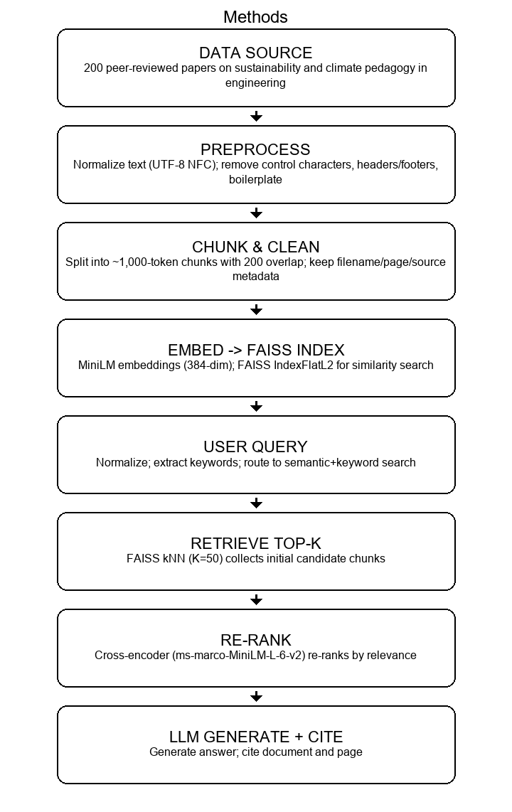

### ScaffoldAI — High‑Level Research Handoff (Concise)

This document gives a plain, high‑level overview for instructors and reviewers. It avoids external links and numeric results and uses only the correct local figure.

#### Purpose
- Assist educators in designing sustainability and climate‑resilience curriculum by turning course PDFs and questions into sourced, explainable suggestions.

#### What the system does
- Ingests course materials (PDFs) and prepares them for retrieval.
- Answers questions with relevant excerpts and clear citations from the uploaded materials.
- Provides a simple classroom‑ready Windows application (no Python required for teachers).

#### How it works (at a glance)
- Chunk and embed syllabus/reading PDFs into a vector index (FAISS).
- Retrieve top‑matching passages for a user question and assemble context.
- Run a small language model to draft an answer grounded in those passages.
- Return the answer with citations back to the user interface.

#### Methods (figure)

#### What ships in this repository
- Teacher application (Windows folder build) plus example index files under `vector_outputs`.
- Core processing modules in `scaffold_core/` (PDF processing, retrieval, LLM, citations).
- Enhanced Flask UI under `frontend/`.

#### Running options (one‑sentence pointers)
- Teachers: use the zipped Windows app folder and follow `TEACHER_ZIP_RUN.md` in this repository.
- Developers: use Python 3.12, install requirements, and start the Enhanced UI.

#### Notes on access
- Some models may require a Hugging Face token. A temporary token can be placed in `.env.local` next to the app; long‑term use should employ a personal token.

#### Maintenance pointers
- When adding new PDFs, re‑create the vector index to keep retrieval accurate.
- Prefer small, well‑cited answers in the UI; review and refine prompts as needed.

#### Next steps (concise)
- Data corpus curation: consolidate sources, set a refresh cadence, record provenance.
- Index maintenance: scheduled re‑embedding, version FAISS/metadata, verify integrity.
- Retrieval quality: deduplicate by DOI/URL, tune top‑k, consider a lightweight reranker.
- Evaluation protocol: periodic sampling with a rubric and a brief written summary.
- Model governance: define model selection policy, manage tokens, document fallbacks.
- UX and accessibility: ensure keyboard navigation, contrast compliance, and citation export.
- Packaging and distribution: reproducible signed builds, checksum files, smoke‑test matrix.
- Privacy and security: minimize PII, manage `.env` securely, publish a usage policy.
- Observability: structured logs, latency breakdowns, simple health checks.
- Performance: preload models, enable ONNX/quantization where appropriate, cache hot queries.
- Teaching deployment: provide a one‑page quick start and classroom network guidance.
- Documentation: keep this handoff and the teacher guide synchronized at release.

