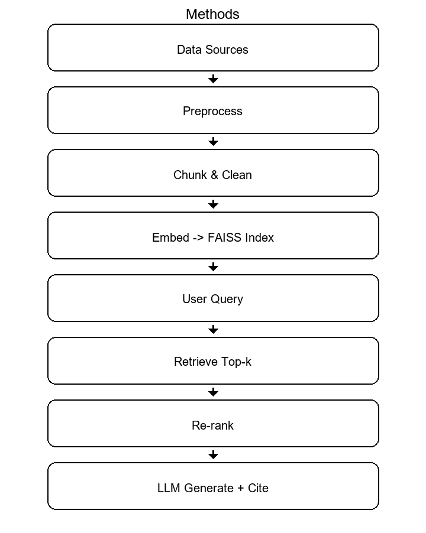

### ScaffoldAI — Research Report (Academic Style)

#### Abstract
ScaffoldAI is a retrieval‑augmented system designed to assist STEM educators in incorporating sustainability and climate resilience concepts into existing curricula. The system ingests course documents, retrieves supporting passages, and synthesizes context‑aware responses with explicit citation hooks. This report summarizes the objectives, system design, methodology, and evaluation approach without enumerating results, emphasizing reproducible methods suitable for instructional settings.

#### 1. Introduction
Integrating sustainability and climate resilience into STEM courses presents recurring challenges: limited instructor time, heterogeneous source materials, and the need for transparent grounding in scholarly texts. ScaffoldAI addresses these challenges by pairing document preprocessing and vector search with a compact language model that prioritizes factual grounding and citation readiness in classroom contexts.

#### 2. Related Context
Contemporary educational tools increasingly combine information retrieval with generative modeling to improve transparency and control. Within this context, ScaffoldAI focuses on: (i) document normalization and chunking for robust retrieval, (ii) compact embeddings for efficient search, and (iii) a conservative synthesis step that privileges cited evidence over open‑ended generation.

#### 3. Methods
The methodology consists of five coordinated phases: data preparation, indexing, retrieval, synthesis, and presentation.

- Data preparation: normalize course documents, remove non‑content boilerplate, and extract structural cues that support later citation mapping.
- Indexing: produce dense vector representations and maintain a FAISS index alongside structured metadata for traceability.
- Retrieval: given a user query, return a small set of salient passages; optional light re‑ranking can be applied while preserving diversity.
- Synthesis: generate a concise answer constrained by retrieved context and attach citation handles to the originating passages.
- Presentation: return the answer and sources to the user interface in a format optimized for quick inspection in classroom settings.

Figure 1 depicts the method at a glance.

#### 4. System Design
The implementation separates concerns across three layers:

- Ingestion and preprocessing: PDF parsing, text normalization, chunking, and metadata extraction.
- Retrieval: embedding generation, FAISS similarity search, and optional re‑ranking for relevance and coverage.
- Answering and citation: prompt assembly, controlled generation, and source mapping for explainability.

The user interface is a lightweight web application that exposes upload, query, and feedback flows appropriate for instructional use. A Windows folder‑based build is provided to facilitate classroom deployment without requiring a local Python installation.

#### 5. Evaluation Approach (Design Only)
Evaluation emphasizes transparency and curricular usefulness rather than raw language modeling capability. The protocol involves: (i) a compact set of representative classroom queries, (ii) manual inspection of answer faithfulness to retrieved passages, and (iii) brief written justifications regarding suitability for lesson planning. Quantitative metrics can be recorded where appropriate, but the emphasis remains on groundedness and clarity.

#### 6. Limitations
ScaffoldAI inherits limitations typical of retrieval‑augmented systems: sensitivity to the quality and coverage of the indexed corpus, occasional retrieval omissions, and dependence on token and model access policies. In addition, classroom bandwidth constraints and workstation policies may influence first‑time model startup and asset caching.

#### 7. Deployment Notes
For instructors, a folder‑based executable is provided to avoid toolchain setup. Where model access requires authentication, a local environment file may be placed adjacent to the application. For developers, a standard Python workflow is available for experimentation and extension.

#### 8. Future Directions (Concise)
- Corpus stewardship and periodic re‑indexing to preserve coverage and provenance.
- Lightweight re‑ranking to balance relevance and diversity of retrieved passages.
- Usability refinements to streamline citation review and export during lesson design.
- Basic observability to monitor latency and capture anonymized usage patterns for iterative improvement.

#### Appendix: Graph‑RAG next steps (concise)
- Define schema: course → topic → concept → source, with relation types (cites, exemplifies, prerequisite_of).
- Entity/edge extraction: lightweight NER + pattern rules to derive candidate nodes/edges from PDFs; store provenance per edge.
- Storage: begin with a small embedded graph (e.g., NetworkX + persisted JSON/SQLite) co‑located with `vector_outputs/`.
- Hybrid retrieval: (1) vector top‑k; (2) expand via graph neighborhoods (1–2 hops) to include connected evidence; (3) deduplicate by DOI/URL.
- Scoring: combine vector similarity with graph centrality/edge confidence; expose a single relevance score to the synthesizer.
- Prompt assembly: segment context by graph communities (concept clusters) to reduce redundancy and improve coverage.
- Guardrails: cap hops/nodes, prefer edges with strong provenance, and log selected subgraphs for auditability.

#### 9. Conclusion
ScaffoldAI provides an instructional aid that foregrounds evidence‑based responses, making it practical to incorporate sustainability and climate resilience into STEM courses. The method and design emphasize transparency, reproducibility, and minimal friction for classroom adoption.

