# Project Roles and Responsibilities

## Swimlane Diagram: Team Coordination

```mermaid
flowchart LR
    subgraph Data["Data Team (Kevin)"]
        A1[Corpus Curation ✅]
        A2[Data Preprocessing ✅]
        A3[Embedding Generation ✅]
        A4[Citation Extraction 🔄]
    end
    
    subgraph Engineering["Engineering Team (Joseph)"]
        B1[Retrieval System Integration ✅]
        B2[LLM Selection & Integration ✅]
        B3[System Architecture ✅]
        B4[Performance Optimization 📋]
    end
    
    subgraph Frontend["Frontend Team (Kevin)"]
        C1[UI Development 🔄]
        C2[User Experience Design 🔄]
        C3[Citation Display Integration 🔄]
        C4[Result Visualization 📋]
    end
    
    subgraph QA["Quality Assurance (Kevin & Joseph)"]
        D1[System Validation 📋]
        D2[Stakeholder Feedback 📋]
        D3[Final Testing & Documentation 📋]
        D4[Deployment Preparation 📋]
    end

    A1 --> A2 --> A3 --> B1
    B1 --> B2 --> B3
    A3 --> C1
    B2 --> C2
    A4 --> C3
    C1 --> D1
    C3 --> D1
    B4 --> D1
    D1 --> D2 --> D3 --> D4
    
    style A1 fill:#90EE90
    style A2 fill:#90EE90
    style A3 fill:#90EE90
    style B1 fill:#90EE90
    style B2 fill:#90EE90
    style B3 fill:#90EE90
    style A4 fill:#FFE4B5
    style C1 fill:#FFE4B5
    style C2 fill:#FFE4B5
    style C3 fill:#FFE4B5
    style B4 fill:#FFA07A
    style C4 fill:#FFA07A
    style D1 fill:#FFA07A
    style D2 fill:#FFA07A
    style D3 fill:#FFA07A
    style D4 fill:#FFA07A
```

## Team Responsibilities

### Kevin (@kevinmastascusa)
- **Primary Focus:** Data pipeline, UI/UX, project coordination
- **Current Tasks:**
  - Citation integration completion
  - UI finalization and testing
  - Stakeholder communication coordination
- **Upcoming Tasks:**
  - User experience validation
  - Documentation completion
  - Stakeholder feedback collection

### Joseph (@Aethyrex)
- **Primary Focus:** System architecture, LLM integration, backend engineering
- **Current Tasks:**
  - Citation tracking system completion
  - Performance optimization
  - System integration testing
- **Upcoming Tasks:**
  - System validation and QA support
  - Technical documentation
  - Deployment architecture

### Shared Responsibilities
- **System Testing:** Both Kevin and Joseph
- **Final Documentation:** Collaborative effort
- **Stakeholder Demos:** Joint presentation
- **Project Timeline Management:** Shared ownership

## Communication Protocols

### Daily Coordination
- **Method:** Slack/GitHub issues for technical coordination
- **Frequency:** As needed for blockers and critical decisions
- **Documentation:** All decisions logged in GitHub issues

### Weekly Reviews
- **Schedule:** Mondays at 9:00 AM
- **Duration:** 30 minutes
- **Agenda:** Progress review, blocker identification, week planning
- **Documentation:** Updated in PROGRESS.md

### Milestone Reviews
- **Schedule:** End of each major phase
- **Participants:** Kevin, Joseph, key stakeholders
- **Format:** Demo + technical review
- **Documentation:** Formal milestone reports