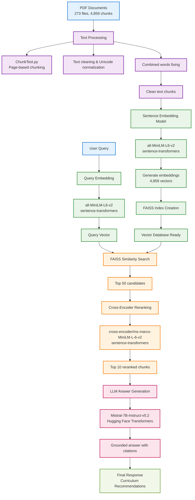
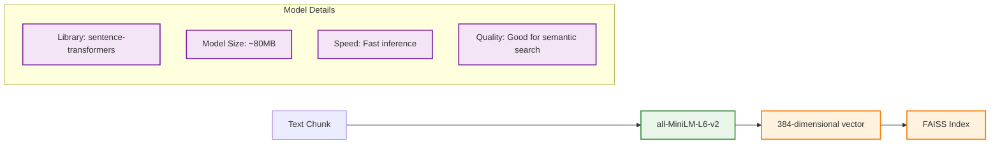
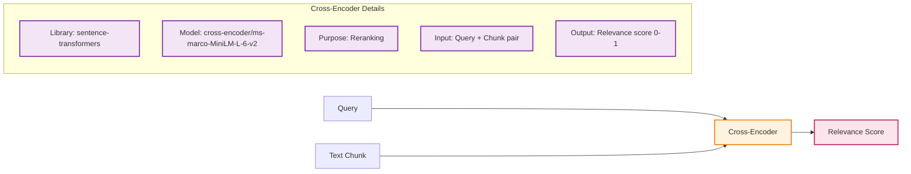
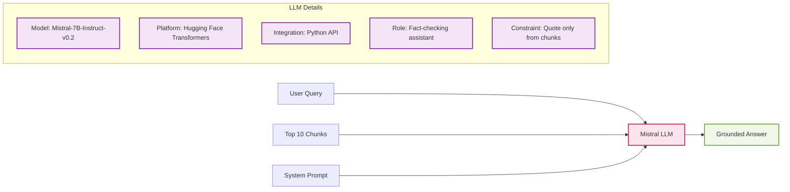
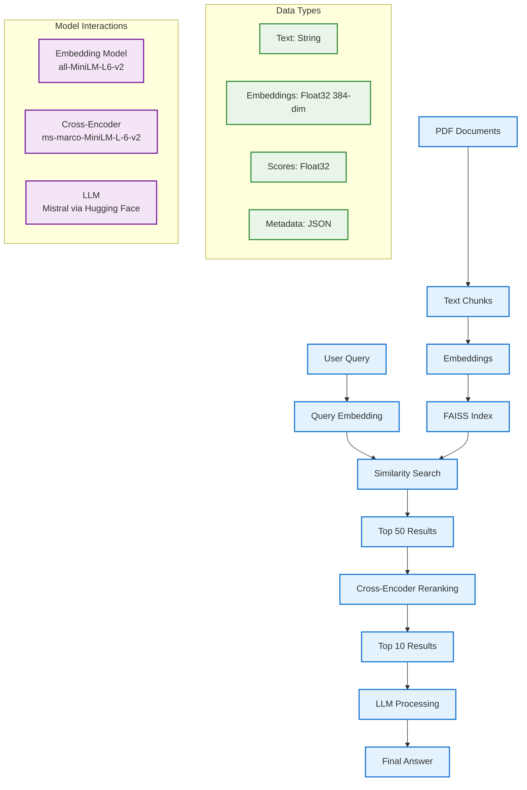
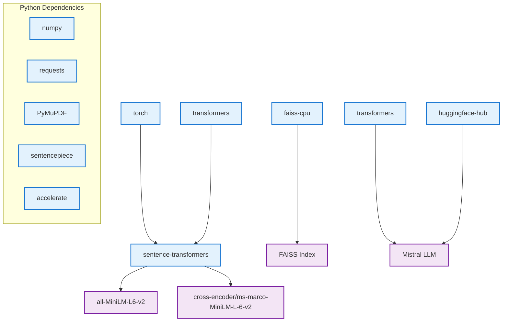

# Model Architecture Diagrams

**Last Updated:** June 29, 2025  
**Status:** Updated for Hugging Face Integration

This document contains visual diagrams of the confirmed working models in the Scaffold AI pipeline, based on the actual implemented codebase.

---

## 1. Complete Model Pipeline Architecture

---

## 2. Model Details and Specifications

### Embedding Model: all-MiniLM-L6-v2

### Cross-Encoder Model: ms-marco-MiniLM-L-6-v2

### LLM Model: Mistral via Hugging Face

---

## 3. Data Flow Between Models

---

## 4. Model Configuration (Current Settings)

| Model | Configuration | Location | Status |
|-------|---------------|----------|--------|
| **Embedding** | `all-MiniLM-L6-v2` | `scaffold_core/config.py` | ✅ Working |
| **Cross-Encoder** | `cross-encoder/ms-marco-MiniLM-L-6-v2` | `scaffold_core/vector/query.py` | ✅ Working |
| **LLM** | `mistralai/Mistral-7B-Instruct-v0.2` (Hugging Face) | `scaffold_core/config.py` | ✅ Working |
| **FAISS Index** | `IndexFlatL2` | `scaffold_core/vector/transformVector.py` | ✅ Working |

---

## 5. Performance Characteristics

### Embedding Model
- **Speed**: ~1000 chunks/second
- **Memory**: ~80MB model size
- **Quality**: Good semantic similarity
- **Vector Dimension**: 384

### Cross-Encoder Model
- **Speed**: ~100 pairs/second
- **Memory**: ~80MB model size
- **Quality**: High reranking accuracy
- **Input**: Query-chunk pairs

### LLM Model
- **Speed**: ~2-5 seconds per query
- **Memory**: ~7GB (Mistral-7B-Instruct-v0.2)
- **Quality**: High-quality reasoning with constraints
- **Platform**: Hugging Face Transformers (Python API)

---

## 6. Model Dependencies

---

*These diagrams reflect the current working implementation as of June 29, 2025. All models shown are confirmed to be functional and integrated into the pipeline. The system has been successfully migrated from Ollama to Hugging Face Transformers for LLM functionality.* 